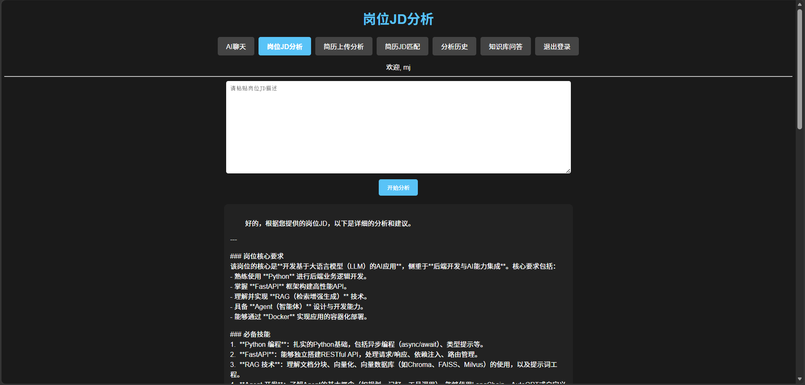
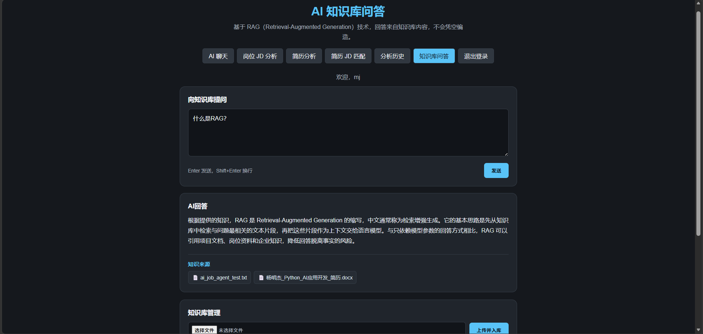
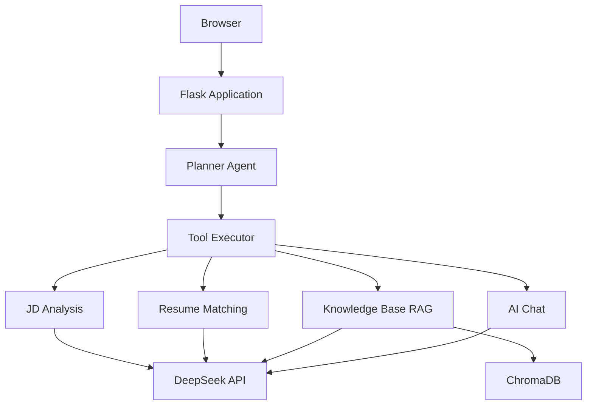
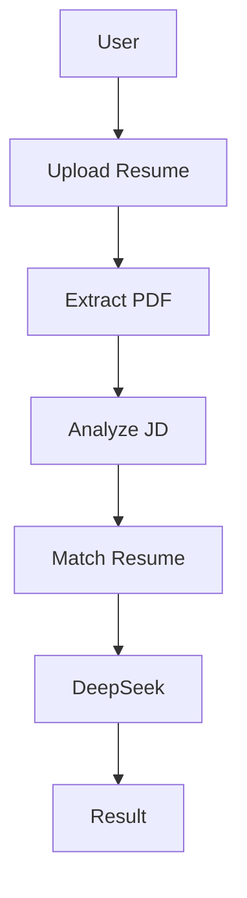
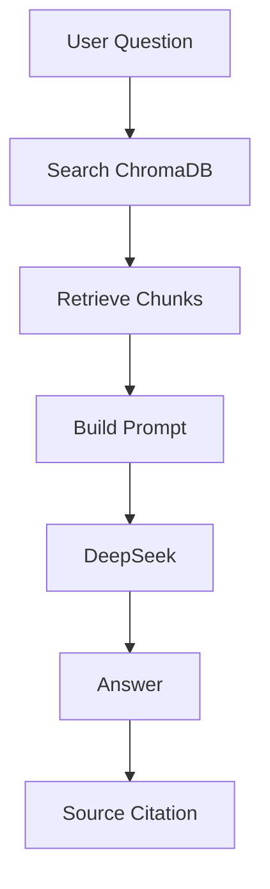
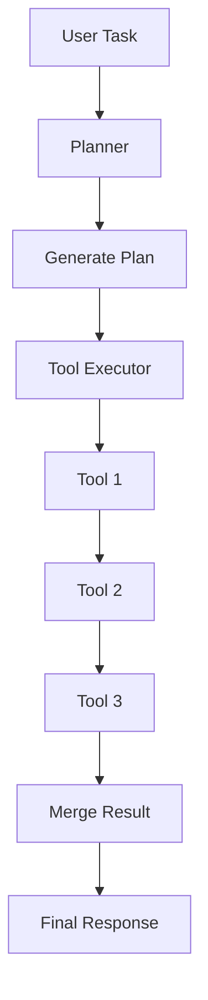

# 🚀 AI Job Agent

An open-source Flask application that combines DeepSeek, RAG, and Planner Agent workflows for practical AI-assisted job search tasks.

AI Job Agent 是一个面向求职场景的 AI 应用，支持简历解析、岗位 JD 分析、简历匹配和面试准备。项目适用于 AI 应用开发实践、求职准备和岗位分析场景，并展示了从知识检索到多步骤工具编排的完整流程。

[](https://www.python.org/)
[](https://flask.palletsprojects.com/)
[](https://www.deepseek.com/)
[](https://en.wikipedia.org/wiki/Knowledge_retrieval)
[](https://www.trychroma.com/)
[](#)
[](#)
[](https://www.docker.com/)
[](https://render.com/)
[](LICENSE)

## ✨ Key Features

- ✅ AI Chat
- ✅ Resume Parsing
- ✅ JD Analysis
- ✅ Resume Matching
- ✅ Knowledge Base (RAG)
- ✅ Function Calling
- ✅ Planner Agent
- ✅ Knowledge Upload
- ✅ Docker Deployment

## 💡 Project Highlights

- DeepSeek LLM Integration
- Retrieval-Augmented Generation (RAG)
- Planner Agent Multi-step Workflow
- Function Calling & Tool Calling
- Chroma Persistent Vector Database
- Docker Deployment

## 📸 Project Preview

### 🏠 Home Dashboard


AI Job Agent 的主界面，可快速进入 AI 聊天、简历解析、岗位分析、知识库等功能。

### 💬 AI Chat


基于 DeepSeek 的智能聊天助手，支持自然语言问答。

### 📄 Job Description Analysis



分析岗位 JD，提取技能要求、职责和匹配建议。

### 🎯 Resume Matching


自动分析简历与岗位 JD，输出匹配度、优势、短板和建议。

### 📚 Knowledge Base (RAG)



基于 ChromaDB 的知识库问答，支持来源引用和检索增强生成。

### 📜 History


保存历史分析记录，方便查看和管理。

## 🏗 System Architecture



### Architecture Overview

- Flask 负责 Web 服务和页面路由。
- Planner Agent 负责拆解和规划用户任务。
- Tool Executor 负责安全调用具体业务工具。
- RAG 使用 ChromaDB 进行知识库向量检索。
- DeepSeek 负责分析、问答和最终内容生成。
- 各模块保持解耦，便于扩展新的工具和能力。

# 🔄 Workflow

## Resume Matching Workflow



用户上传 PDF 简历并提交岗位 JD 后触发该流程。系统先提取简历文本，再结合 DeepSeek 输出匹配结果和针对性建议。

## Knowledge Base Workflow (RAG)



用户提出知识库问题时触发该流程。系统先检索相关文本，再让 DeepSeek 基于检索上下文回答并保留来源引用。

## Planner Agent Workflow



当用户一次提出多个关联任务时触发 Planner Agent。系统按计划依次调用工具，汇总真实执行结果后生成最终响应。

# ⭐ Core Features

| Feature | Description |
| --- | --- |
| AI Chat | 基于 DeepSeek 提供自然语言交互，支持日常求职问题咨询。 |
| Resume Parsing | 支持 PDF 简历解析和文本提取，为后续分析提供结构化输入。 |
| Job Description Analysis | 分析岗位 JD 中的技能、职责和要求，帮助明确岗位重点。 |
| Resume Matching | 自动分析简历与岗位的匹配情况，并生成优势、短板和改进建议。 |
| Knowledge Base (RAG) | 基于 ChromaDB 检索知识，并在回答中提供来源引用。 |
| Function Calling | 根据用户意图自动调用不同工具，连接知识库、JD 分析和简历匹配能力。 |
| Planner Agent | 自动拆解复杂任务并执行多步骤工作流，再汇总真实执行结果。 |
| Knowledge Management | 支持 PDF、DOCX、TXT 文档上传、删除和知识库文件管理。 |

### Why AI Job Agent?

- **Modular Architecture**：按应用、服务、路由、RAG 和 Agent 模块组织，便于维护和扩展。
- **RAG**：先检索知识库内容，再生成回答，减少脱离项目资料的回答。
- **Planner Agent**：将复合求职任务拆解为可执行步骤，适合多工具协作。
- **Tool Calling**：通过明确的工具边界连接不同业务能力，保持执行过程可追踪。
- **Easy Deployment**：提供 Render 配置和 Gunicorn 启动方式，便于部署演示。

## 🛠 Technology Stack

| Category | Technologies |
| --- | --- |
| Backend | Python, Flask, Jinja2 |
| AI | DeepSeek API, OpenAI SDK, RAG, ChromaDB, Function Calling, Planner Agent |
| Frontend | HTML, CSS, JavaScript |
| Database | SQLite |
| Document Processing | pypdf, python-docx |
| Networking | httpx |
| Deployment | Gunicorn, Render, Docker |

### Design Principles

- **Modular Design**：按应用、服务、路由、RAG 和 Agent 模块组织代码。
- **Separation of Concerns**：将页面、业务服务、工具执行和数据访问分离。
- **Retrieval-Augmented Generation**：先检索知识库内容，再结合上下文生成回答。
- **Tool-based Architecture**：通过明确的工具边界扩展岗位分析、匹配和知识库能力。
- **Easy Deployment**：使用 Gunicorn 和 Render 配置简化部署流程。

## Project Structure

```text
AI-Job-Agent/
├── agent/
│   ├── agent_service.py
│   ├── execution_context.py
│   ├── planner_service.py
│   ├── plan_models.py
│   ├── tool_executor.py
│   └── tool_registry.py
├── rag/
│   ├── document_loader.py
│   ├── embedding_service.py
│   ├── rag_service.py
│   ├── text_splitter.py
│   └── vector_store.py
├── routes/
│   ├── agent_routes.py
│   └── rag_routes.py
├── scripts/
│   ├── ingest_documents.py
│   └── test_rag_search.py
├── services/
│   ├── deepseek_service.py
│   ├── job_analysis_service.py
│   └── rag_answer_service.py
├── templates/
│   ├── index.html
│   ├── jd.html
│   ├── resume.html
│   ├── match.html
│   ├── history.html
│   ├── knowledge_chat.html
│   ├── login.html
│   └── register.html
├── knowledge_base/
│   └── documents/
│       └── ai_job_agent_test.txt
├── images/
│   ├── home.png
│   ├── chat.png
│   ├── jd.png
│   ├── match.png
│   ├── knowledge.png
│   └── history.png
├── app.py
├── database.py
├── requirements.txt
├── render.yaml
├── LICENSE
└── README.md
```

## Quick Start

### 1. Clone the repository

```bash
git clone https://github.com/yangmingjie67-debug/AI-Job-Agent.git
cd AI-Job-Agent
```

### 2. Create a virtual environment

```bash
python -m venv nenv
```

Windows:

```powershell
nenv\Scripts\activate
```

macOS / Linux:

```bash
source nenv/bin/activate
```

### 3. Install dependencies

```bash
pip install -r requirements.txt
```

### 4. Configure environment variables

Windows:

```powershell
copy .env.example .env
```

macOS / Linux:

```bash
cp .env.example .env
```

Then set `DEEPSEEK_API_KEY` and `FLASK_SECRET_KEY` in `.env`.

### 5. Start the application

```bash
python app.py
```

Open `http://127.0.0.1:5000` in your browser.

## ⚙️ Environment Variables

| Variable | Description | Required |
| --- | --- | --- |
| `DEEPSEEK_API_KEY` | API key used for DeepSeek model calls. | Yes |
| `FLASK_SECRET_KEY` | Secret used to sign Flask sessions. | Yes in production |

# 🗺 Roadmap

## ✅ V1

- AI Chat
- Resume Parsing
- JD Analysis
- Resume Matching

## ✅ V2

- RAG
- Knowledge Base
- Function Calling
- Planner Agent
- Knowledge Upload
- Multi-step Workflow

## 🚧 V3

- Memory
- Browser Automation
- Multi-Agent Collaboration
- More LLM Providers
- BOSS Workflow Automation

## License

MIT License.

This project is intended for learning, AI application development, and portfolio demonstration.
