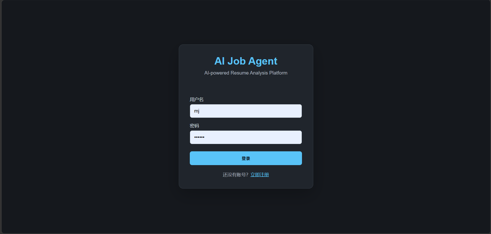
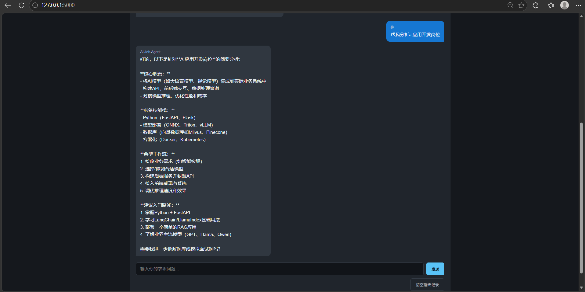
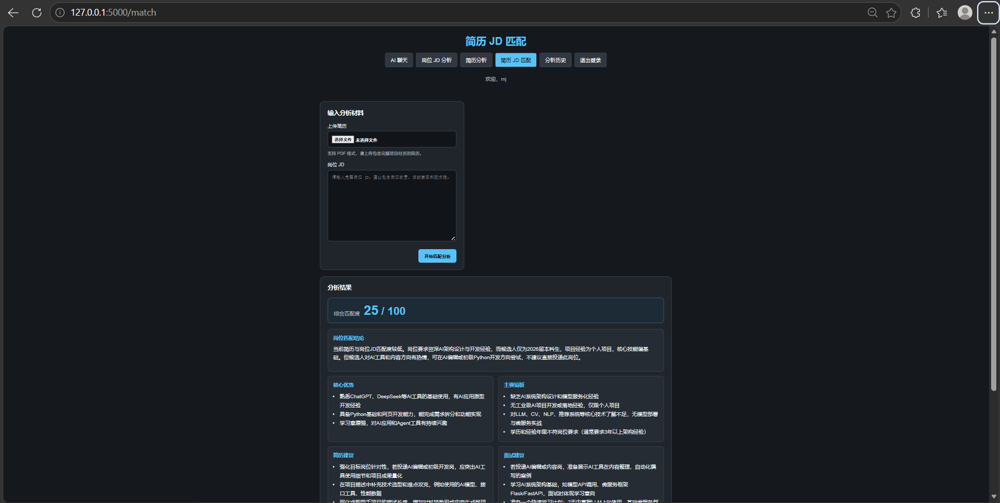
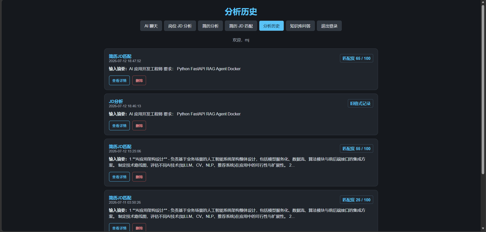

# AI Job Agent

基于 Python、Flask 和 DeepSeek API 的 AI 求职助手，帮助求职者分析简历、理解岗位要求并提升投递准备效率。

## 项目截图









请将对应页面截图放入 `images` 目录。

## 功能介绍

- AI 智能聊天
- PDF 简历上传与文本解析
- 岗位 JD 分析
- AI 简历岗位匹配
- 综合匹配度评分
- 核心优势分析
- 当前短板分析
- 简历优化建议
- 面试准备建议
- BOSS 招呼语生成
- 分析历史记录管理
- 用户登录与注册

## 技术栈

- Python
- Flask
- SQLite
- DeepSeek API
- OpenAI SDK
- httpx
- Jinja2
- HTML / CSS
- JavaScript（基础页面交互）
- pypdf（PDF 文本解析）

## 项目结构

```text
ai-chat-app/
├── app.py                         # Flask 应用入口与路由
├── database.py                    # SQLite 数据库操作
├── services/
│   ├── __init__.py
│   ├── deepseek_service.py        # DeepSeek 客户端与统一调用入口
│   └── job_analysis_service.py    # 岗位匹配、JSON 解析与容错
├── routes/                        # 后续路由模块化拆分预留
├── templates/
│   ├── index.html                 # AI 聊天页
│   ├── jd.html                    # JD 分析页
│   ├── resume.html                # 简历分析页
│   ├── match.html                 # 简历与 JD 匹配页
│   ├── history.html               # 历史记录页
│   ├── login.html                 # 登录页
│   └── register.html              # 注册页
├── requirements.txt
├── render.yaml                    # Render 部署配置
├── test_deepseek.py               # DeepSeek 连接诊断脚本
├── .env                           # 本地 API 配置，不提交到 Git
└── README.md
```

本地 SQLite 数据库文件和虚拟环境目录不属于应用源码，也不会提交到 GitHub。

## 快速运行

### 1. 安装依赖

```bash
pip install -r requirements.txt
```

### 2. 配置 DeepSeek API Key

在项目根目录创建 `.env` 文件：

```env
DEEPSEEK_API_KEY=your_deepseek_api_key
```

请勿将 `.env` 或真实 API Key 提交到仓库。

### 3. 启动应用

```bash
python app.py
```

浏览器访问：

```text
http://127.0.0.1:5000
```

## 项目亮点

- **渐进式模块化**：在保留现有 Flask 应用结构的基础上，将数据库、DeepSeek 调用和岗位匹配逻辑拆分到独立模块。
- **Service 分层**：通过 `deepseek_service.py` 和 `job_analysis_service.py` 隔离外部模型调用与岗位分析业务。
- **Prompt Engineering**：围绕岗位要求、匹配技能、短板、简历优化和面试准备设计结构化分析提示词。
- **JSON 结构化输出**：岗位匹配结果统一转换为结构化字段，便于页面展示和后续功能扩展。
- **PDF 文本解析**：支持上传 PDF 简历并提取文本内容进行分析。
- **AI 岗位匹配**：结合简历内容与岗位 JD，输出匹配度和针对性建议。
- **异常处理**：对 API 连接异常、非标准 JSON 和无效分析结果提供日志记录与备用结果。
- **容错设计**：对评分范围、列表字段和缺失字段进行统一归一化，降低模型输出不稳定对页面的影响。

## 后续计划

- 多份简历管理与版本对比
- GitHub 登录
- 多模型切换
- Agent 自动求职流程
- BOSS 等招聘平台 API 对接

## License

本项目目前主要用于个人学习、求职展示和 AI 应用开发实践。
